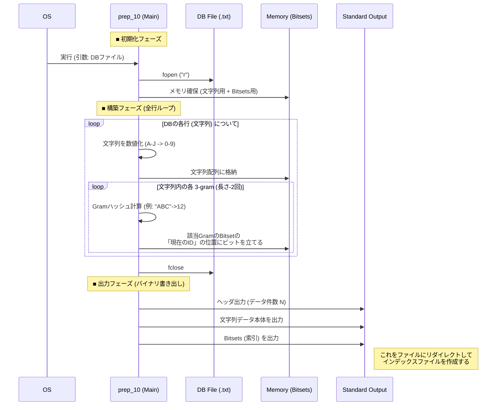
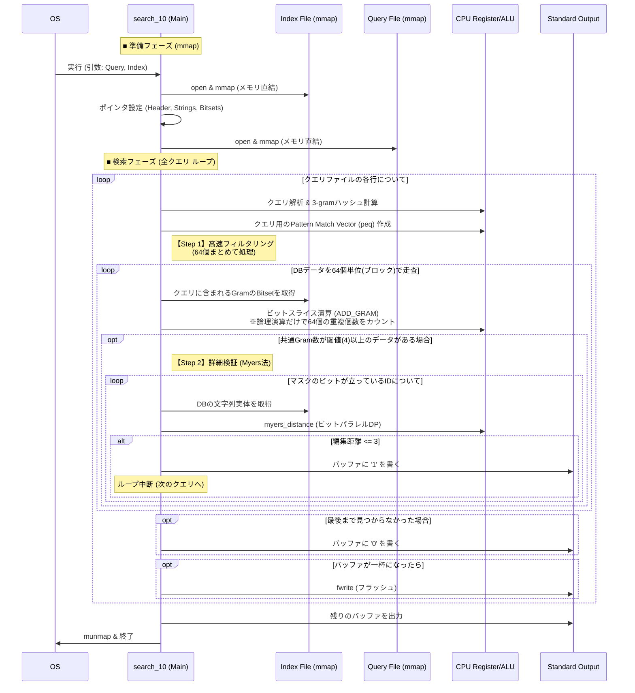

## prep

```mermaid
sequenceDiagram
    participant OS
    participant Main as prep_10 (Main)
    participant DB as DB File (.txt)
    participant Mem as Memory (Bitsets)
    participant Stdout as Standard Output

    Note over Main: ■ 初期化フェーズ
    OS->>Main: 実行 (引数: DBファイル)
    Main->>DB: fopen ("r")
    Main->>Mem: メモリ確保 (文字列用 + Bitsets用)

    Note over Main: ■ 構築フェーズ (全行ループ)
    loop DBの各行 (文字列) について
        Main->>Main: 文字列を数値化 (A-J -> 0-9)
        Main->>Mem: 文字列配列に格納
        
        loop 文字列内の各 3-gram (長さ-2回)
            Main->>Main: Gramハッシュ計算 (例: "ABC"->12)
            Main->>Mem: 該当GramのBitsetの<br/>「現在のID」の位置にビットを立てる
        end
    end
    Main->>DB: fclose

    Note over Main: ■ 出力フェーズ (バイナリ書き出し)
    Main->>Stdout: ヘッダ出力 (データ件数 N)
    Main->>Stdout: 文字列データ本体を出力
    Main->>Stdout: Bitsets (索引) を出力
    
    Note right of Stdout: これをファイルにリダイレクトして<br/>インデックスファイルを作成する
```

## search

```mermaid
sequenceDiagram
    participant OS
    participant Main as search_10 (Main)
    participant IDX as Index File (mmap)
    participant Qry as Query File (mmap)
    participant Logic as CPU Register/ALU
    participant Stdout as Standard Output

    Note over Main: ■ 準備フェーズ (mmap)
    OS->>Main: 実行 (引数: Query, Index)
    Main->>IDX: open & mmap (メモリ直結)
    Main->>Main: ポインタ設定 (Header, Strings, Bitsets)
    Main->>Qry: open & mmap (メモリ直結)

    Note over Main: ■ 検索フェーズ (全クエリ ループ)
    loop クエリファイルの各行について
        Main->>Logic: クエリ解析 & 3-gramハッシュ計算
        Main->>Logic: クエリ用のPattern Match Vector (peq) 作成

        Note right of Main: 【Step 1】高速フィルタリング<br/>(64個まとめて処理)
        loop DBデータを64個単位(ブロック)で走査
            Main->>IDX: クエリに含まれるGramのBitsetを取得
            Main->>Logic: ビットスライス演算 (ADD_GRAM)<br/>※論理演算だけで64個の重複個数をカウント
            
            opt 共通Gram数が閾値(4)以上のデータがある場合
                Note right of Main: 【Step 2】詳細検証 (Myers法)
                loop マスクのビットが立っているIDについて
                    Main->>IDX: DBの文字列実体を取得
                    Main->>Logic: myers_distance (ビットパラレルDP)
                    
                    alt 編集距離 <= 3
                        Main->>Stdout: バッファに '1' を書く
                        Note over Main: ループ中断 (次のクエリへ)
                    end
                end
            end
        end

        opt 最後まで見つからなかった場合
            Main->>Stdout: バッファに '0' を書く
        end
        
        opt バッファが一杯になったら
            Main->>Stdout: fwrite (フラッシュ)
        end
    end

    Main->>Stdout: 残りのバッファを出力
    Main->>OS: munmap & 終了
```